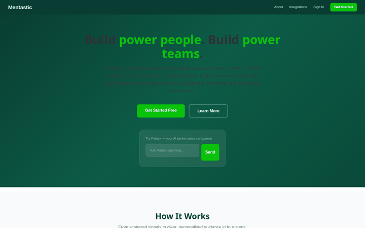

# Mentastic

Human performance and readiness platform — AI-powered decision support for individuals, teams, and institutions. Combines LangGraph agents, WebSocket streaming, and a 3-pane FastHTML chat interface with Patrick, your AI companion for performance, readiness, and resilience.



## Features

**Patrick AI Companion** — 6 tools for human performance and readiness:

| Tool | Type | Description |
|------|------|-------------|
| Readiness Check-In | DB-backed | Record energy, focus, stress, and mood (1-10 scale) |
| Readiness Report | DB-backed | View trends and patterns over 7/14/30 days |
| Performance Scan | Conversational | AI-guided analysis of your current performance state |
| Recovery Plan | Conversational | Personalized recovery recommendations |
| Stress & Load Analysis | Conversational | Assess stress levels and burnout risk |
| Resilience Builder | Conversational | Guided exercises for 6 focus areas (stress, energy, focus, sleep, pressure, general) |

**3-Pane Chat Interface:**
- **Left sidebar** — Auth (login/register), conversation history, About section
- **Center pane** — WebSocket streaming chat with 6 welcome cards
- **Right pane** (toggled) — Thinking trace showing tool calls and agent activity

**Authentication** — Clerk (email / Google / Apple) with fallback email/password:
- Anonymous mini-chat on landing page — try Patrick before signing up
- After 5 messages, Patrick suggests creating an account
- Clerk handles sign-in/sign-up UI with social login (Google, Apple, Facebook)
- Falls back to email/password when Clerk is not configured

**Additional Features:**
- Configurable LLM model via `MODEL_NAME` env var (default: `grok-4-fast-reasoning`)
- Chat history persistence in PostgreSQL
- 12 data integrations (wearables, calendar, social) via arcade.dev / composio.dev
- PWA support (manifest, service worker, responsive CSS)
- Docker deployment ready

## Demo

Full walkthrough: [docs/demo_video.mp4](docs/demo_video.mp4) | All screenshots: [screenshots/](screenshots/)

## Quick Start

```bash
# Clone
git clone https://github.com/predictivelabsai/mentastic.git
cd mentastic

# Setup
python -m venv .venv
source .venv/bin/activate
pip install -r requirements.txt

# Configure
cp .env.sample .env
# Edit .env with your keys (see Environment Variables below)

# Run database schema
psql $DB_URL -f sql/01_create_schema.sql

# Start
python app.py
# Open http://localhost:5010
```

### Docker

```bash
docker compose up --build
# Open http://localhost:5010
```

## Environment Variables

| Variable | Default | Description |
|----------|---------|-------------|
| `DB_URL` | (required) | PostgreSQL connection string |
| `XAI_API_KEY` | (required) | XAI API key for Grok LLM |
| `MODEL_NAME` | `grok-4-fast-reasoning` | LLM model name (configurable) |
| `JWT_SECRET` | auto-generated | Secret for JWT session signing |
| `CLERK_PUBLISHABLE_KEY` | (optional) | Clerk publishable key for social login |
| `CLERK_SECRET_KEY` | (optional) | Clerk secret key for JWT verification |

## Tech Stack

| Component | Technology |
|-----------|-----------|
| Frontend | FastHTML + HTMX (3-pane layout, WebSocket streaming) |
| AI Engine | LangGraph + XAI Grok (6 tools, react agent) |
| Database | PostgreSQL (5 tables, `mentastic` schema) |
| Auth | Email/password + bcrypt + JWT sessions |
| PWA | Service worker + manifest.json + responsive CSS |
| Deployment | Docker + docker-compose |

## Database Schema

5 tables in the `mentastic` schema:

| Table | Purpose |
|-------|---------|
| `users` | User accounts (email, password, display name) |
| `chat_conversations` | Chat thread metadata (title, timestamps) |
| `chat_messages` | Individual messages (role, content, metadata) |
| `readiness_checkins` | Check-in data (energy, focus, stress, mood 1-10) |
| `session_summaries` | Patrick's memory across sessions |

## Testing

```bash
# Run full test suite (19 tests)
python tests/test_suite.py

# Capture user guide screenshots (app must be running)
python tests/capture_guide.py

# Generate demo video and GIF (app must be running)
python tests/capture_video.py
```

### Test Coverage

| Category | Tests | What's covered |
|----------|-------|----------------|
| DB | 4 | Connection, schema, tables |
| Auth | 3 | Password hashing, JWT, user CRUD |
| Chat Store | 1 | Save/load/delete conversations |
| Agent | 7 | Tools, prompt, LLM config, factory, all 4 conversational tools |
| Config | 2 | Environment vars, app imports |
| **Total** | **19** | **All pass** |

## Architecture

```
mentastic/
├── app.py                    # Main FastHTML 3-pane app (UI, routes, WS streaming)
├── requirements.txt          # Python dependencies
├── Dockerfile                # Container image
├── docker-compose.yaml       # Single-service deployment
├── sql/
│   └── 01_create_schema.sql  # PostgreSQL schema (5 tables)
├── utils/
│   ├── db.py                 # SQLAlchemy connection pool
│   ├── auth.py               # bcrypt + JWT authentication
│   ├── chat_store.py         # Chat persistence (PostgreSQL)
│   └── agent.py              # LangGraph agent + 6 tools + Patrick prompt
├── static/
│   ├── manifest.json         # PWA manifest
│   └── sw.js                 # Service worker
├── tests/
│   ├── test_suite.py         # 19 automated tests
│   ├── capture_guide.py      # Playwright screenshot capture
│   └── capture_video.py      # Playwright video capture
├── screenshots/              # UI screenshots (13 images)
└── docs/
    ├── demo_video.mp4        # Product demo video
    ├── demo_video.gif        # Animated preview
    └── frames/               # Individual video frames
```

## About Mentastic

Mentastic is a human performance intelligence system that turns fragmented data into actionable clarity. By combining passive and active inputs — including wearables, sleep, mood, behaviour patterns, digital habits, self-reports, psychometrics and AI-guided dialogue — Mentastic helps individuals and organisations understand readiness, detect early strain, and improve resilience and performance over time.

**Core promise:** Mentastic helps people and organisations stay ready, perform well under pressure, and sustain strong results without drifting into overload.

**Positioning:** From fragmented signals to performance clarity.

**Target sectors:** Military & defence, private sector employers, government, hospitals, schools, and frontline organisations.

## License

See [LICENSE](LICENSE) file.
