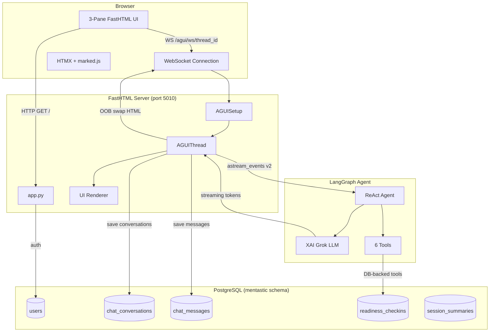
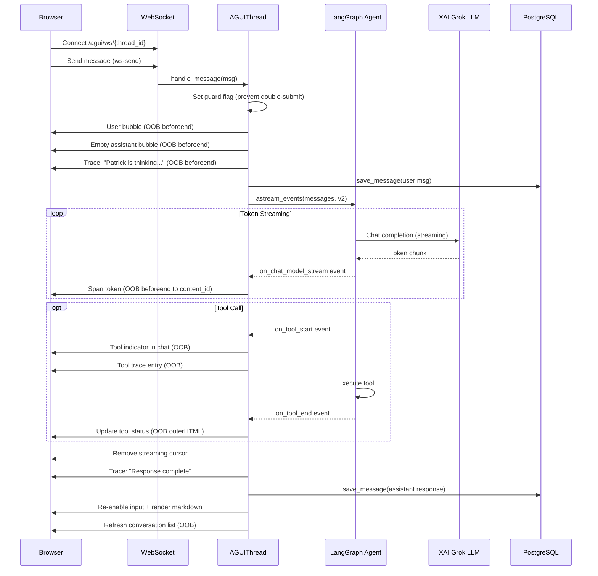
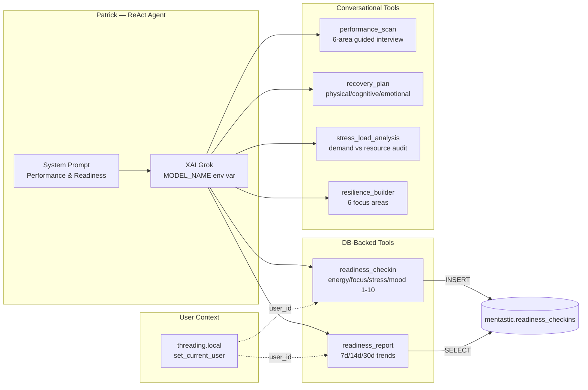
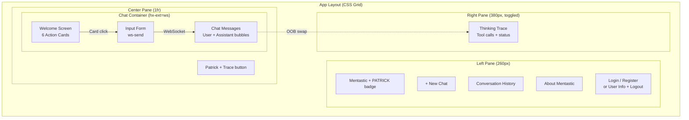
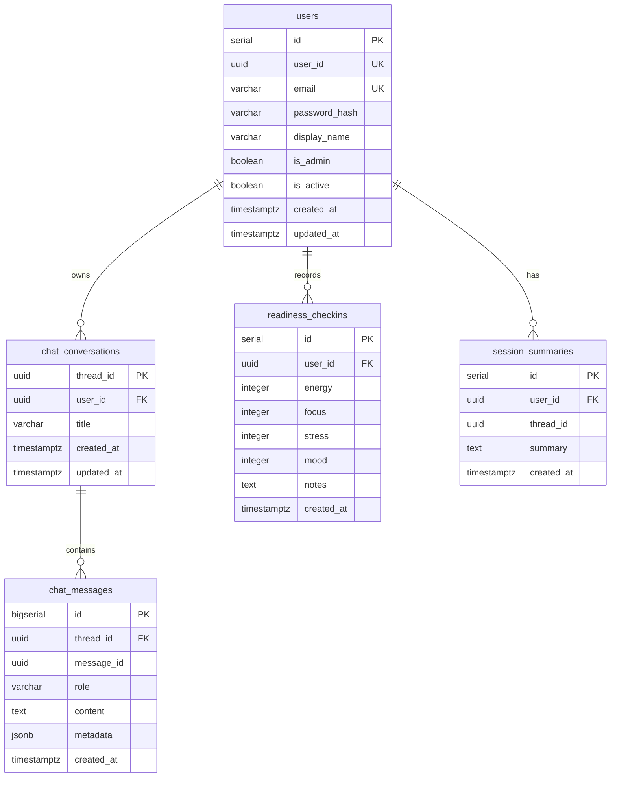
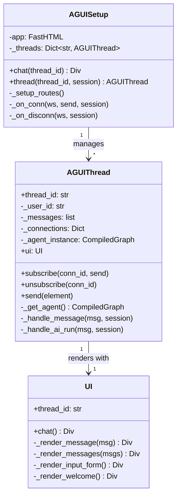
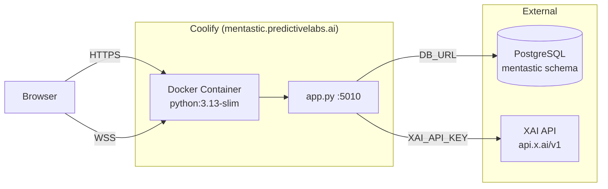
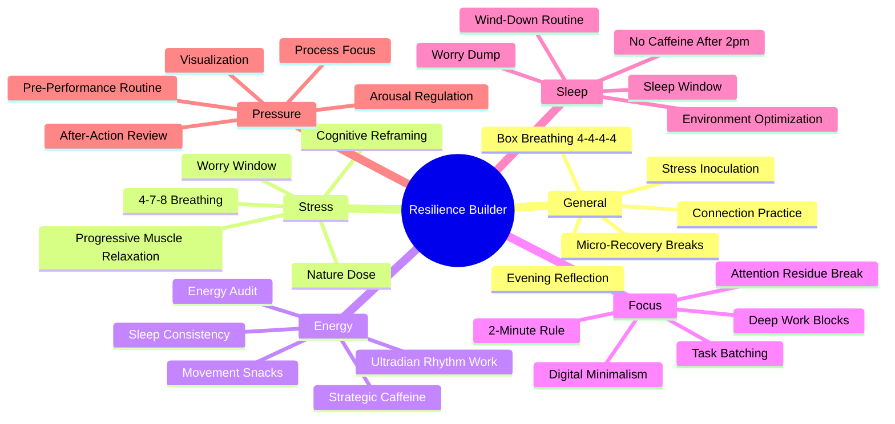

# Mentastic Architecture

## System Overview

## WebSocket Streaming Flow

## Agent Architecture

## 3-Pane UI Layout

## Database Schema

## Class Hierarchy

## Deployment

## Tool Detail: Resilience Builder Focus Areas

