# Mentastic Architecture

Mentastic is built as a single-process server-rendered application using the **AG UI** (Agentic Graphical User Interface) pattern — a design philosophy where the AI agent is not hidden behind an API, but is the interface itself. The user interacts directly with the agent through a streaming conversational UI, while the system makes its reasoning process visible in real time.

This document describes the system architecture, the user journey, the AG UI concept, and the technical flow from landing page to agent response.

---

## User Journey

The platform follows a progressive engagement model: visitors can try Patrick anonymously on the landing page, then create an account to unlock the full experience.

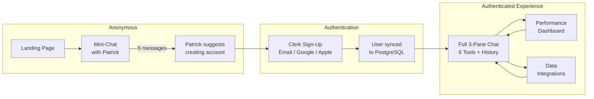

---

## The AG UI Concept

Traditional AI applications treat the model as a backend service: the user fills a form, the server calls an API, and a result is returned. AG UI inverts this. The agent becomes a first-class participant in the interface — it streams its thinking, shows tool calls as they happen, and the user watches the reasoning unfold token by token.

In Mentastic, this means:

- **Streaming-first interaction.** Every response from Patrick is streamed via WebSocket. The user sees tokens appear in real time, not after a loading spinner.
- **Transparent tool execution.** When Patrick calls a tool (e.g. saving a readiness check-in or generating a resilience plan), the tool call appears in the Thinking Trace panel.
- **Conversational agency.** The 6 welcome cards are conversation starters, not static forms. Clicking "My Readiness Now" sends a natural language message to Patrick, who calls the appropriate tool, analyses the data, and provides personalised insight.
- **Anonymous-first onboarding.** Visitors try Patrick directly on the landing page — no account required. After 5 messages, Patrick suggests creating an account.
- **No page reloads.** The entire interaction happens over a single WebSocket connection using HTMX out-of-band (OOB) swaps.

---

## 3-Pane Design Principles

**Left Pane (260px) — Context & Navigation.** Shows auth state, conversation history, and links to Dashboard and Integrations. Provides orientation without competing with the conversation.

**Center Pane (flexible) — Conversation.** The streaming dialogue with Patrick. The welcome screen shows 6 cards: 3 for viewing current state (My Readiness Now, Performance Overview, Stress & Load Check) and 3 for improvement actions (Readiness Check-In, Recovery Plan, Resilience Builder).

**Right Pane (380px, toggled) — Thinking Trace.** Shows the agent's internal activity: tool calls, execution status, and completion. Opens automatically during AI runs.

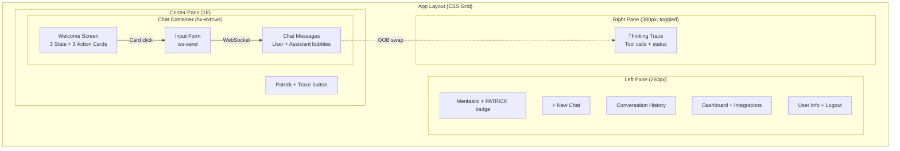

---

## System Overview

The system is a single Python process running FastHTML. There is no separate frontend build, no API gateway, and no message queue. The browser connects via HTTP for the initial page load and then upgrades to a WebSocket for the chat session.

The LangGraph agent runs in-process, streaming events directly to the WebSocket handler. PostgreSQL stores user accounts, conversation history, and readiness check-in data. The LLM (XAI Grok) is accessed via an OpenAI-compatible API. Authentication is handled by Clerk (email, Google, Apple) with a fallback to email/password.

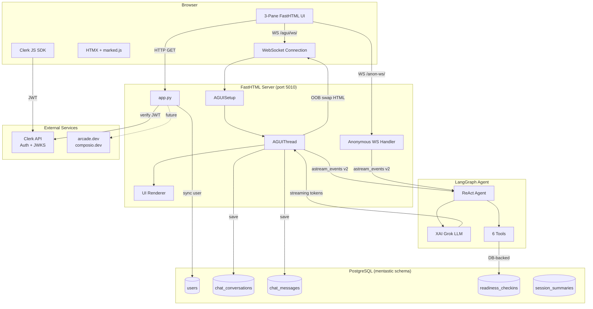

---

## WebSocket Streaming Flow

When a user sends a message, the following sequence occurs — all within a single WebSocket connection:

1. The user's message is immediately rendered as a chat bubble (optimistic UI).
2. An empty assistant bubble is created with a streaming cursor.
3. The LangGraph agent begins processing, and events are streamed back.
4. Each token is appended to the assistant bubble in real time via HTMX OOB swap.
5. If the agent calls a tool, it appears in both the chat and the Thinking Trace panel.
6. When complete, raw text is replaced with server-side rendered markdown.

Time to first token: ~0.5 seconds. Full response: ~2-3 seconds.

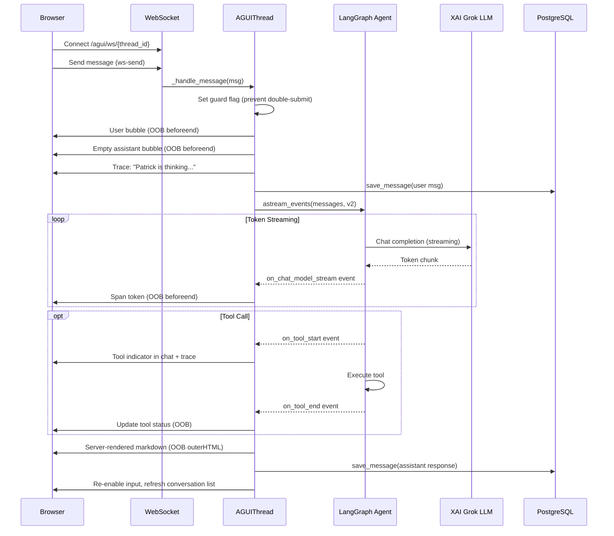

---

## Agent Architecture

Patrick uses LangGraph's `create_react_agent` — a ReAct (Reasoning + Acting) agent. The 6 tools are split into two categories:

**DB-backed tools** persist data and query patterns. The readiness check-in saves energy/focus/stress/mood (1-10) to PostgreSQL. The readiness report aggregates check-ins and detects trends.

**Conversational tools** return structured frameworks that Patrick weaves into personalised dialogue. The same recovery plan tool produces different conversations depending on the user's context.

The LLM model is configurable via `MODEL_NAME` (default: `grok-4-fast-reasoning`). The agent is created per-thread and cached.

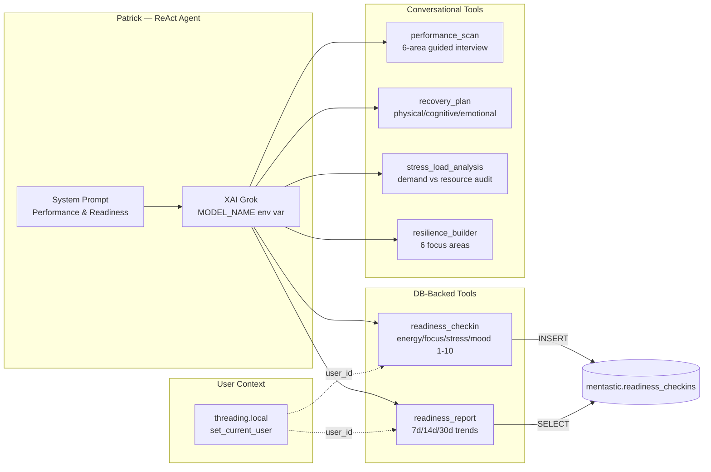

---

## Authentication Flow

Mentastic supports two auth modes: **Clerk** (email, Google, Apple) and **fallback** (email/password). When Clerk is configured, the sign-in/sign-up pages mount Clerk's prebuilt UI components. The backend verifies Clerk JWTs via their JWKS endpoint and syncs user data to the local PostgreSQL database.

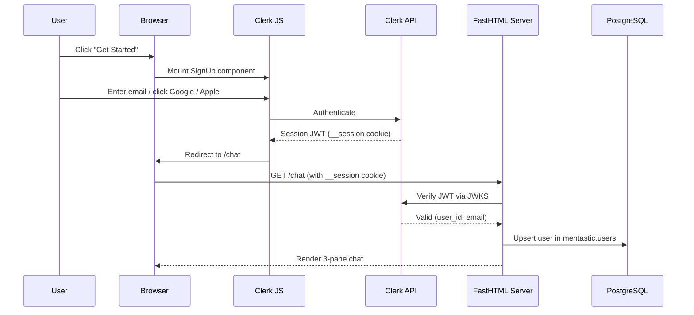

---

## Dashboard

The performance dashboard shows mock data styled like Apple/Google fitness apps. In production, this data comes from readiness check-ins and connected integrations. Charts are rendered as inline SVG — no JavaScript chart libraries.

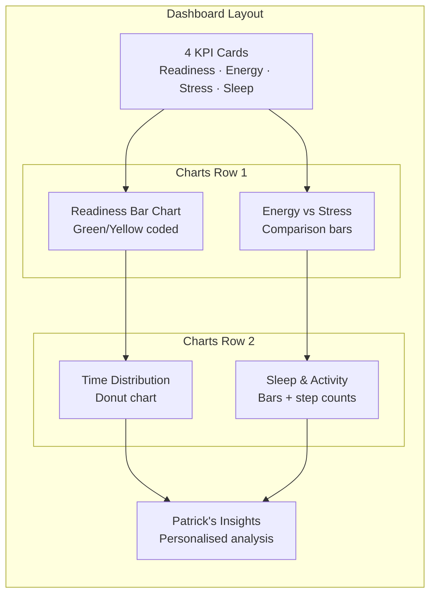

---

## Data Integrations

Mentastic connects to 16 data sources via three integration providers:

- **[Thryve Health](https://thryve.health)** — Unified wearable hub providing access to 500+ devices through a single API. Delivers 18 data categories (sleep, HR, HRV, activity, body composition, blood glucose, respiratory, VO2max) plus analytics: sleep quality scoring, fitness age calculation, and mental health risk assessment. Thryve handles device authorization, real-time data sync, and data normalization.
- **[arcade.dev](https://arcade.dev)** — OAuth-based integrations for Google Fit, Apple Health, Google Calendar, Spotify, Slack.
- **[composio.dev](https://composio.dev)** — Oura Ring, Garmin, Strava, and other wearable-specific integrations.

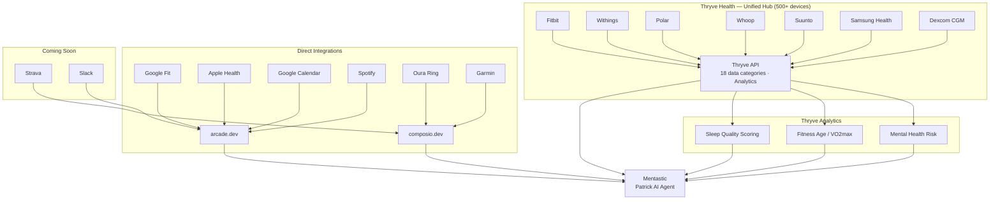

Each integration has a connection flow: detail page (what data is accessed, privacy info) → confirm → connected state with disconnect option.

---

## Database Schema

5 tables in the `mentastic` schema. No ORM models — all queries use raw SQL via SQLAlchemy's `text()`.

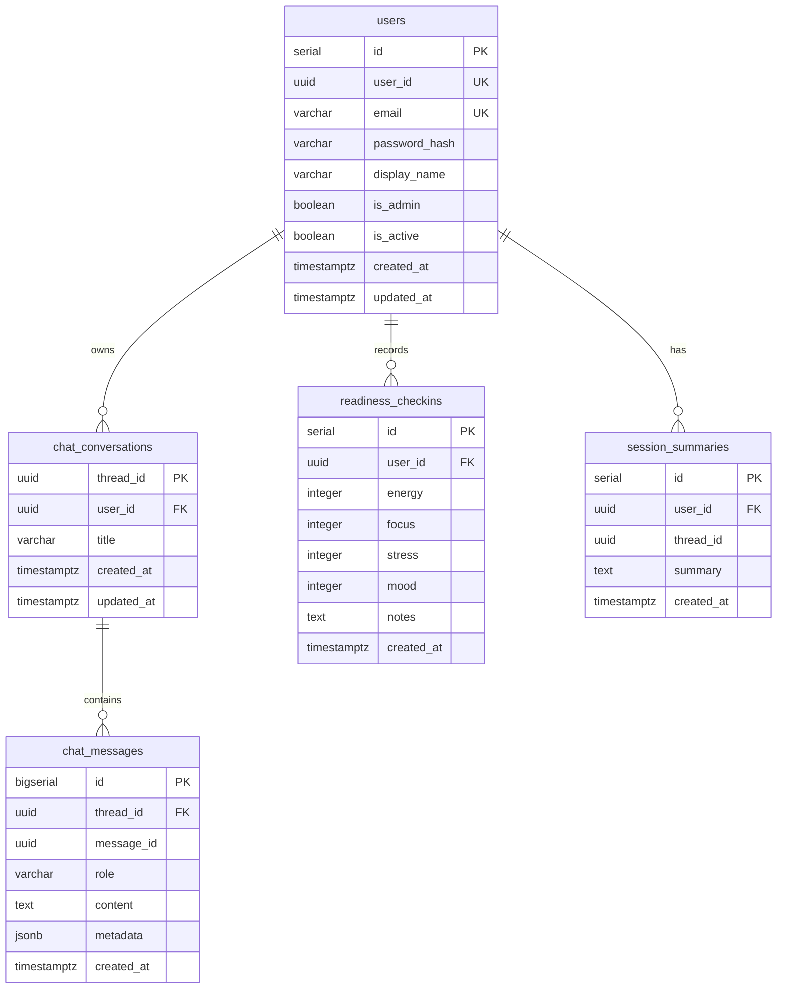

---

## Class Hierarchy

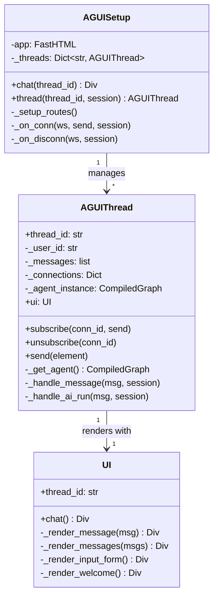

---

## Deployment

Single Docker container on Coolify at `mentastic.predictivelabs.ai`. PostgreSQL, XAI API, and Clerk are external services.

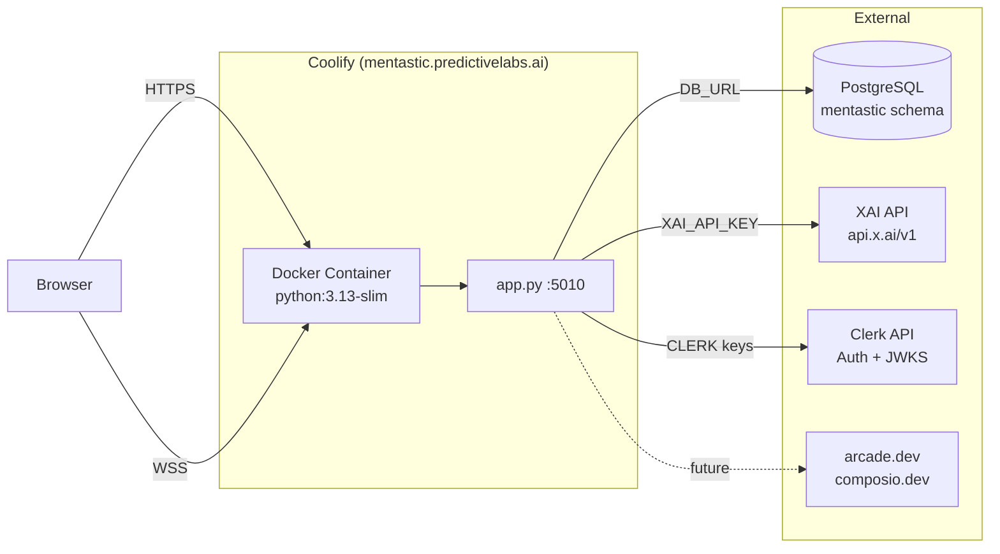

---

## Resilience Builder: Tool Detail

30 evidence-based exercises across 6 focus areas. Patrick selects the appropriate set based on the user's request and adapts presentation to the individual.

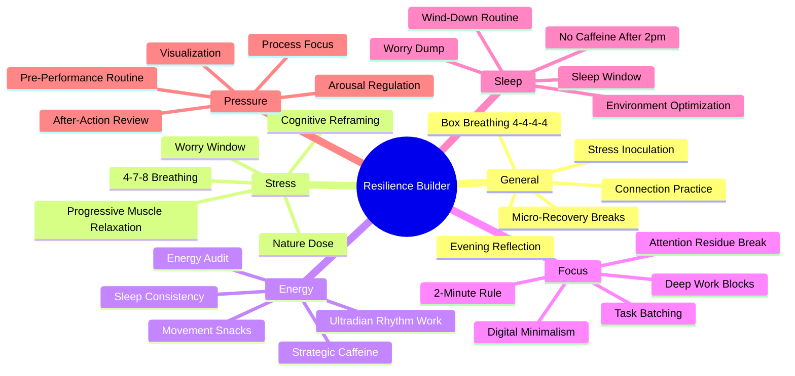
