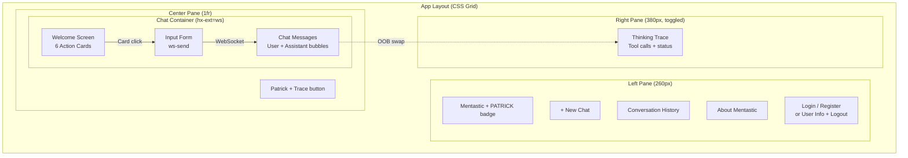
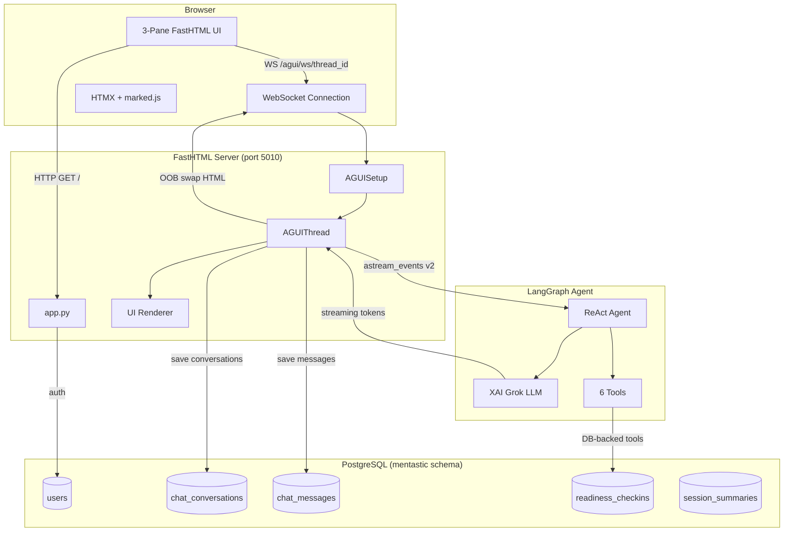
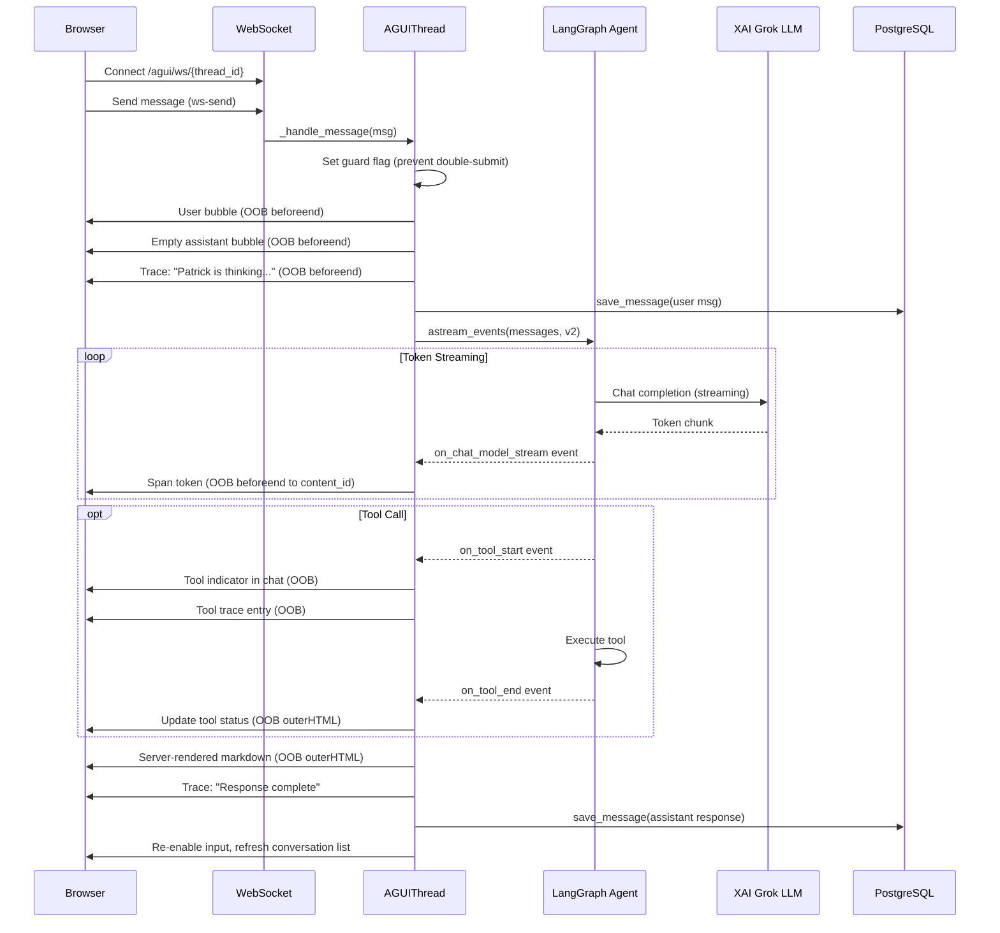
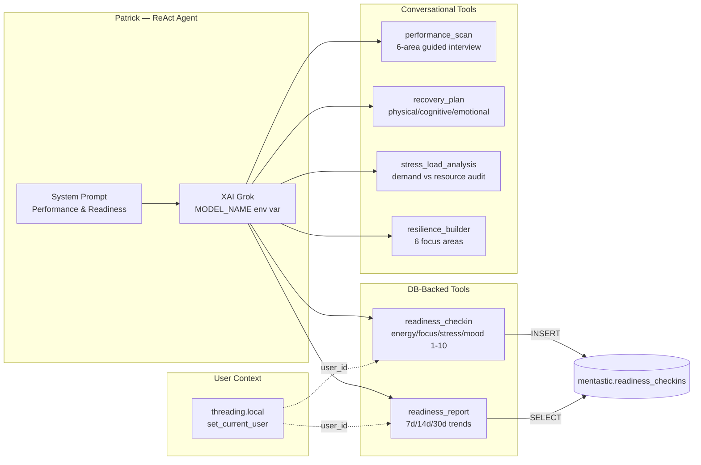
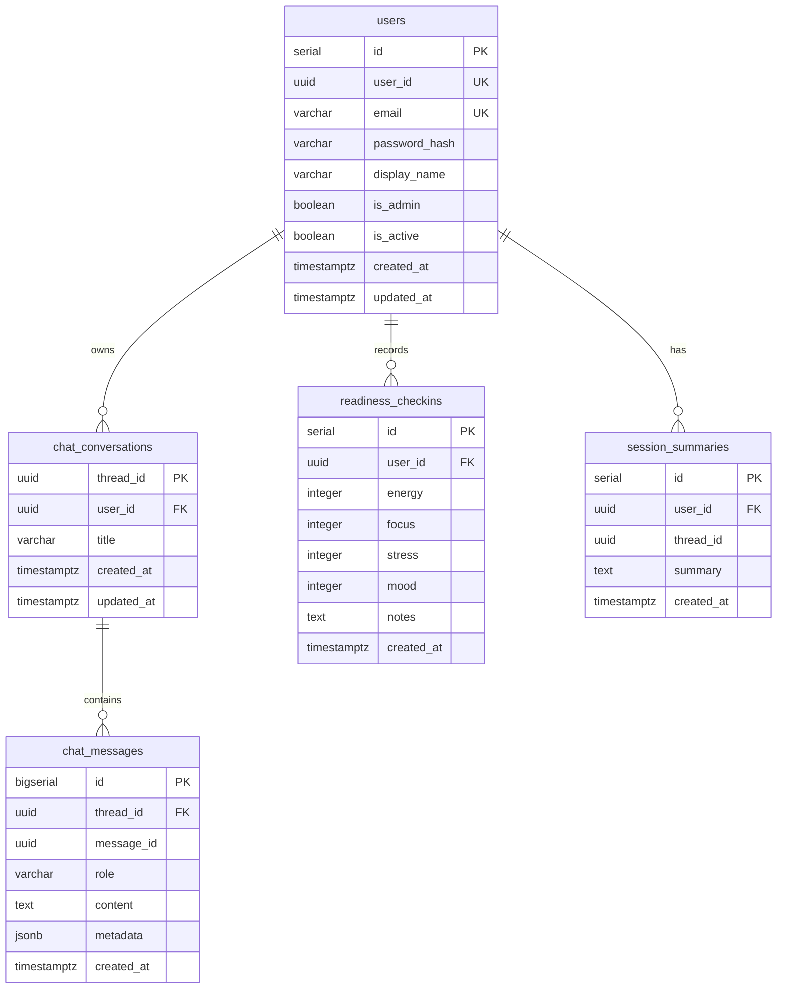
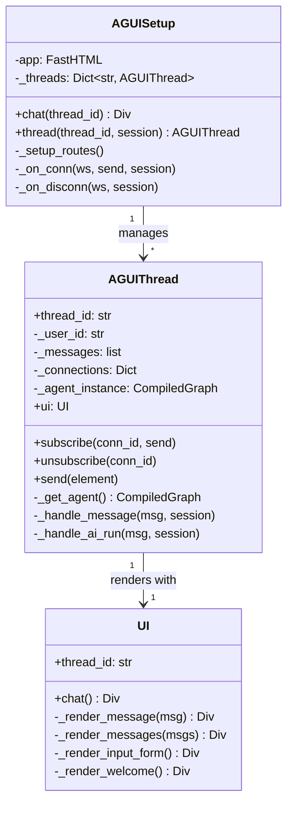
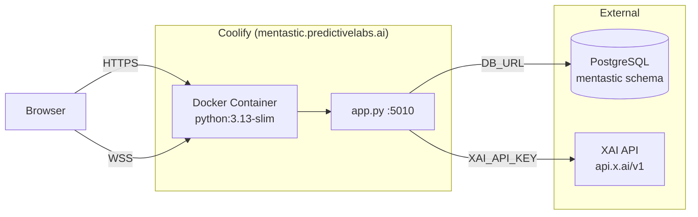
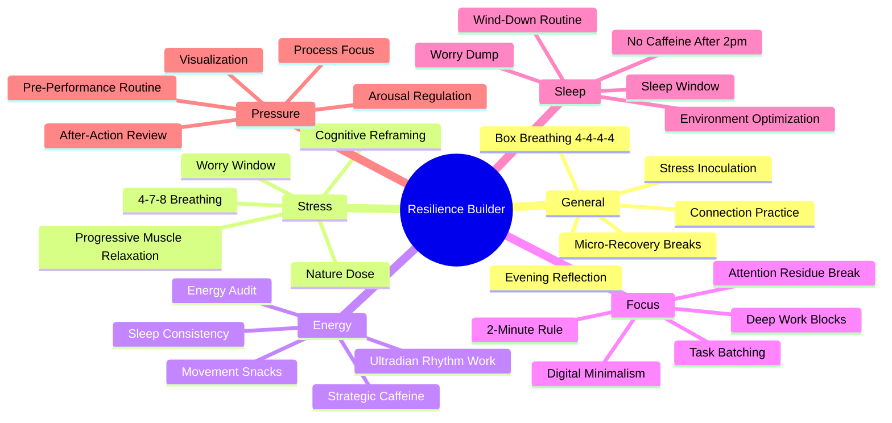

# Mentastic Architecture

Mentastic is built as a single-process server-rendered application using the **AG UI** (Agentic Graphical User Interface) pattern — a design philosophy where the AI agent is not hidden behind an API, but is the interface itself. The user interacts directly with the agent through a streaming conversational UI, while the system makes its reasoning process visible in real time.

This document describes the system architecture, the AG UI concept, the 3-pane design, and the technical flow from user input to agent response.

---

## The AG UI Concept

Traditional AI applications treat the model as a backend service: the user fills a form, the server calls an API, and a result is returned. AG UI inverts this. The agent becomes a first-class participant in the interface — it streams its thinking, shows tool calls as they happen, and the user watches the reasoning unfold token by token.

In Mentastic, this means:

- **Streaming-first interaction.** Every response from Patrick (the AI companion) is streamed via WebSocket. The user sees tokens appear in real time, not after a loading spinner.
- **Transparent tool execution.** When Patrick calls a tool (e.g. saving a readiness check-in to the database, or generating a resilience exercise plan), the tool call appears in the Thinking Trace panel — the user can see what the agent decided to do and why.
- **Conversational agency.** The 6 welcome cards are not static forms — they are conversation starters. Clicking "Readiness Check-In" sends a natural language message to Patrick, who then uses the appropriate tool, asks follow-up questions, and provides personalised insight. The agent decides the flow, not a hardcoded wizard.
- **No page reloads.** The entire interaction happens over a single WebSocket connection using HTMX out-of-band (OOB) swaps. The chat, trace panel, conversation list, and input state all update simultaneously from a single message stream.

This is fundamentally different from a chatbot with a text box. AG UI makes the agent's reasoning visible and the interaction feel collaborative rather than transactional.

---

## 3-Pane Design Principles

The interface is organised into three panes, each serving a distinct purpose in the agent interaction:

**Left Pane (260px) — Context & Navigation.** This is the user's anchor. It shows who they are (auth state), what conversations they've had (history), and what Mentastic is (About section). It provides orientation without competing with the active conversation.

**Center Pane (flexible) — Conversation.** This is where the work happens. The chat area shows the streaming dialogue with Patrick, including user messages, assistant responses with rendered markdown, and tool execution indicators. The welcome screen with 6 action cards appears for new conversations, providing guided entry points into Patrick's capabilities.

**Right Pane (380px, toggled) — Thinking Trace.** This is what makes AG UI different from a standard chatbot. The trace panel shows the agent's internal activity: when a tool is called, what it's doing, and when it completes. This transparency builds trust — the user understands why Patrick recommended a specific recovery plan or how it analysed their stress patterns. The trace panel opens automatically during AI runs and can be toggled on demand.

On mobile (< 768px), the layout collapses to a single center pane, keeping the conversation front and center.

---

## System Overview

The system is a single Python process running FastHTML (a Starlette-based framework for server-rendered HTMX applications). There is no separate frontend build, no API gateway, and no message queue. The browser connects via HTTP for the initial page load and then upgrades to a WebSocket for the chat session.

The LangGraph agent runs in-process, streaming events directly to the WebSocket handler. PostgreSQL stores user accounts, conversation history, and readiness check-in data. The LLM (XAI Grok) is accessed via an OpenAI-compatible API.

---

## WebSocket Streaming Flow

When a user sends a message, the following sequence occurs — all within a single WebSocket connection, with no page reloads or HTTP round-trips:

1. The user's message is immediately rendered as a chat bubble (optimistic UI).
2. An empty assistant bubble is created with a streaming cursor.
3. The LangGraph agent begins processing, and its events are streamed back.
4. Each token from the LLM is appended to the assistant bubble in real time via HTMX OOB swap.
5. If the agent calls a tool, the tool execution appears in both the chat (as a status indicator) and the Thinking Trace panel.
6. When streaming completes, the raw text is replaced with server-side rendered markdown (bold, lists, headings), the input is re-enabled, and the conversation list is refreshed.

The entire flow takes approximately 0.5 seconds to first token and 2-3 seconds for a complete response.

---

## Agent Architecture

Patrick is built using LangGraph's `create_react_agent` — a ReAct (Reasoning + Acting) agent that can decide when to call tools and when to respond directly. The agent has access to 6 tools, split into two categories:

**DB-backed tools** persist data and query historical patterns. When a user does a readiness check-in, the values are saved to PostgreSQL and available for future trend analysis. The readiness report tool aggregates check-ins over configurable time windows and detects upward stress trends or declining energy.

**Conversational tools** return structured frameworks that Patrick uses to guide the conversation. These don't touch the database — they provide evidence-based content (recovery techniques, resilience exercises, stress assessment frameworks) that Patrick weaves into a personalised dialogue. This means the same tool can produce very different conversations depending on the user's context.

The LLM model is configurable via the `MODEL_NAME` environment variable, defaulting to `grok-4-fast-reasoning`. The agent is created per-conversation thread and cached, so each thread maintains its own tool state and user context.

---

## Database Schema

The database uses a dedicated `mentastic` schema with 5 tables. The design prioritises simplicity — no ORM models, just raw SQL via SQLAlchemy's `text()` function with named parameters. This makes the data layer easy to understand and debug.

The `readiness_checkins` table is the core data model for the DB-backed tools. Each check-in captures a snapshot of the user's state across four dimensions (energy, focus, stress, mood) on a 1-10 scale, with optional free-text notes. The readiness report tool queries this table to identify trends and generate personalised insights.

---

## Class Hierarchy

The application code in `app.py` is structured around three classes that form the AG UI engine:

**AGUISetup** is the entry point. It wires WebSocket routes into the FastHTML app and maintains an in-memory registry of conversation threads. When a WebSocket connects, AGUISetup creates or retrieves the appropriate AGUIThread.

**AGUIThread** is the heart of the system. Each thread represents one conversation with one user. It holds the message history, manages WebSocket subscribers (supporting multiple browser tabs on the same conversation), and orchestrates the LangGraph agent. The `_handle_ai_run()` method is where streaming happens — it calls `agent.astream_events()` and translates each event into an OOB swap sent to all connected browsers.

**UI** is a stateless renderer. It produces the FastHTML components (welcome screen, message bubbles, input form) that AGUIThread sends to the browser. Separating rendering from state management keeps the code clean and testable.

---

## Deployment

Mentastic is deployed as a single Docker container on Coolify at `mentastic.predictivelabs.ai`. The container runs `app.py` directly using FastHTML's built-in `serve()` function (which wraps Uvicorn). PostgreSQL and the XAI API are external services accessed via environment variables.

The architecture is intentionally simple — one process, one container, no orchestration. This makes it easy to deploy, debug, and iterate. The WebSocket connection requires that the reverse proxy (Coolify/Caddy) supports WebSocket upgrades, which is configured automatically.

---

## Resilience Builder: Tool Detail

The resilience builder is the most content-rich conversational tool. It contains 30 evidence-based exercises organised across 6 focus areas. When invoked, Patrick selects the appropriate set based on the user's request, presents them conversationally, and helps the user pick 1-2 to try that week.

This illustrates the AG UI philosophy: the tool provides the knowledge, but the agent provides the interaction. The same exercise set will be presented differently to a stressed executive versus a fatigued military operator, because Patrick adapts tone, emphasis, and follow-up questions to the individual.

